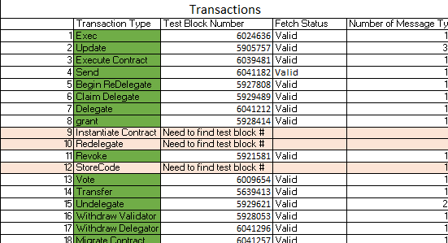
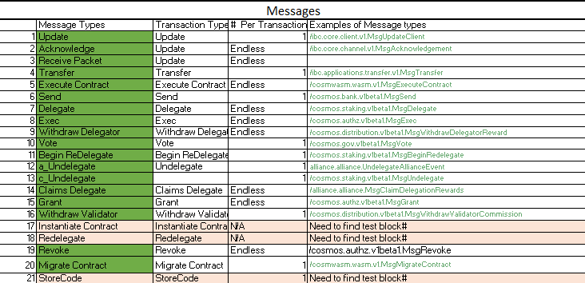
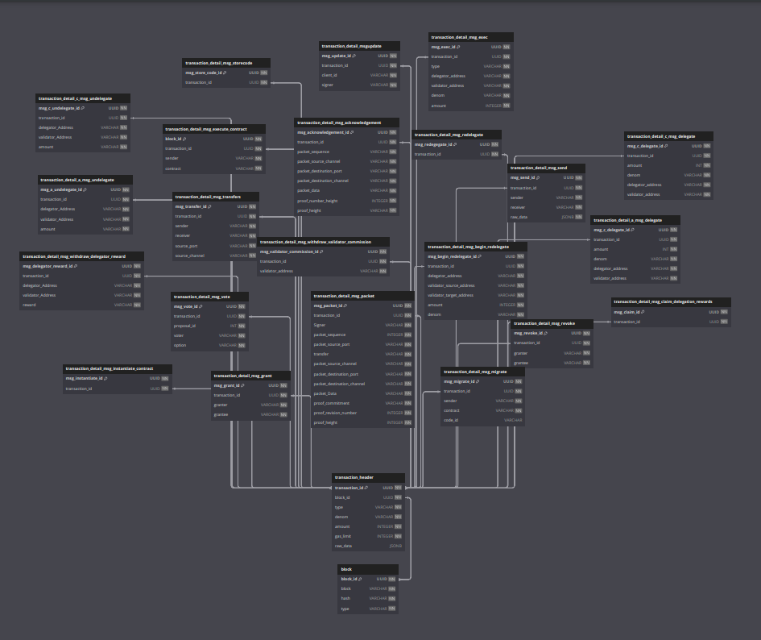

<h1>Indexer Blockchain Project</h1>
<h3> Current working progress is in Steps directory</h3>
<h4> Key files: Extract.pynb, Translate.pynb, load_to_block_table.pynb, load_to_transaction_header_pynb</h4>
<h4> WIP: Transaction Detail Insert statements are in the process of being revised due to recent updates in Schema Design</h4>
<h4>List of transaction types, and test block numbers for each transaction can be found in Transaction_Type_Test_Blocks.xlsx</h4>
<h4>File for ERD diagram can be found in Indexer_ERD_Diagram</h4>

<h2>Project Summary</h2>
<h4>To create a system that can extract JSON files, translate the encrypted transactions, and upload that information into a database that will act as a distributed ledger. 
</h4>
<h3>A.	What Is a Blockchain?</h3>

•	 A blockchain is a distributed database or ledger shared among a network of computers (nodes).

•	While it’s most famous for its role in cryptocurrency systems, it’s not limited to just that.

•	Blockchains can be used to make data in any industry immutable, meaning it cannot be altered.

•	Unlike traditional databases, where trust often relies on third parties, blockchains operate without a central authority.

•	Decentralized blockchains are particularly interesting because no single person or group controls them—instead, all users collectively retain control.

<h3>B.	How Does a Blockchain Work?</h3>

•	Imagine a spreadsheet or database where information is entered and stored.

•	In a blockchain, data is structured differently and accessed via a series of blocks linked together using cryptography.

•	Here’s how it works:

•	Transaction Information: The blockchain collects transaction data and enters it into a block.

•	Creation: A block is created after a predetermined amount of time.
         

•	Chained Blocks: This hash becomes part of the next block, creating a chain of blocks.

•	Immutable: Once data is recorded, it’s irreversible. For example, in Bitcoin, transactions are permanently viewable by anyone.

<h3>Transaction Types</h3>

<h3>Message Types</h3>

<h2>Schema</h2>

<h3>Total Tables: 22 </h3>
<h3>Table Types</h3>
<h4>1.Block Table</h4>
<h5>Consists of every transaction loaded into the system.</h5>
<h4>2.Transaction Header Table </h3>
<h5>The header table will contain overview information for each transaction.</h5>
<h4>3.Transaction Detail Tables</h4>
<h5>Each transaction detail table will contain one message type and provide more in-depth data about what occurred in its related messages.</h5>
<h2>Resources and External Tools links</h2>

a.	https://fio.bloks.io/

 b. https://github.com/White-Whale-Defi-Platform/migaloo-chain.git

c.https://dbdiagram.io/

